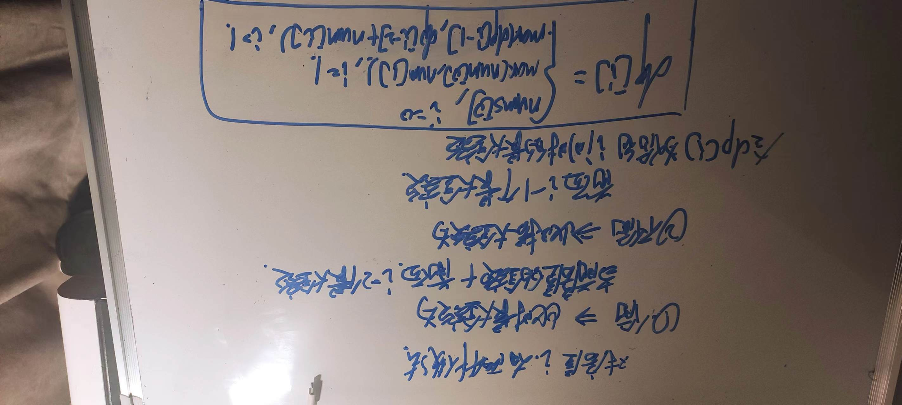
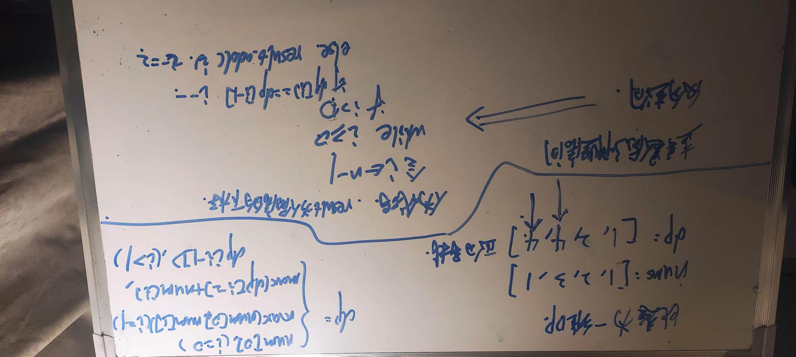

# [打家劫舍](https://leetcode.cn/problems/house-robber/)

你是一个专业的小偷，计划偷窃沿街的房屋。每间房内都藏有一定的现金，影响你偷窃的唯一制约因素就是相邻的房屋装有相互连通的防盗系统，**如果两间相邻的房屋在同一晚上被小偷闯入，系统会自动报警**。

给定一个代表每个房屋存放金额的非负整数数组，计算你不触动警报装置的情况下 ，一夜之内能够偷窃到的最高金额。

 
示例 1：

```txt＝
输入：[1,2,3,1]
输出：4
解释：偷窃 1 号房屋 (金额 = 1) ，然后偷窃 3 号房屋 (金额 = 3)。
     偷窃到的最高金额 = 1 + 3 = 4 。
```

示例 2：

```txt
输入：[2,7,9,3,1]
输出：12
解释：偷窃 1 号房屋 (金额 = 2), 偷窃 3 号房屋 (金额 = 9)，接着偷窃 5 号房屋 (金额 = 1)。
     偷窃到的最高金额 = 2 + 9 + 1 = 12 。
```

提示：

1 <= nums.length <= 100

0 <= nums[i] <= 400


## Solution

> Thinking




> code

```js
/**
 * @param {number[]} nums
 * @return {number}
 */
var rob = function (nums) {
    const n = nums.length;
    if (n === 1) {
        return nums[0]
    }
    let first = 0, second = nums[0], third
    for (let i = 2; i <= n; i++) {
        third = Math.max(first + nums[i - 1], second)
        first = second
        second = third
    }
    return third
};
```

# [打家劫舍 2](https://leetcode.cn/problems/house-robber-ii/)

你是一个专业的小偷，计划偷窃沿街的房屋，每间房内都藏有一定的现金。这个地方所有的房屋都 围成一圈 ，**这意味着第一个房屋和最后一个房屋是紧挨着的**。同时，相邻的房屋装有相互连通的防盗系统，如果两间相邻的房屋在同一晚上被小偷闯入，系统会自动报警 。

给定一个代表每个房屋存放金额的非负整数数组，计算你在不触动警报装置的情况下 ，今晚能够偷窃到的最高金额。

例 1：

```txt
输入：nums = [2,3,2]
输出：3
解释：你不能先偷窃 1 号房屋（金额 = 2），然后偷窃 3 号房屋（金额 = 2）, 因为他们是相邻的。
```

示例 2：

```txt
输入：nums = [1,2,3,1]
输出：4
解释：你可以先偷窃 1 号房屋（金额 = 1），然后偷窃 3 号房屋（金额 = 3）。
     偷窃到的最高金额 = 1 + 3 = 4 。
```


## Solution


相比于第一题，第二题增加了限制条件：首尾相连。

针对这种情况，我们可以分为两种情况

1. 1 -> n-1 的最大可偷金额
2. 2 -> n 的最大可偷金额

而上面，每一种情况就跟第一题相同

> code

```js
/**
 * @param {number[]} nums
 * @return {number}
 */
var rob = function (nums) {
    const n = nums.length
    if (n === 1) {
        return nums[0]
    }
    if (n === 2) {
        return Math.max(nums[0], nums[1])
    }
    let first = 0, second = nums[0], third, result;
    // 针对 1-->n-1
    for (let i = 1; i < n - 1; i++) {
        third = Math.max(first + nums[i], second)
        first = second
        second = third
    }
    result = third
    first = 0, second = nums[1]
    // 针对 2-->n
    for (let i = 2; i < n; i++) {
        third = Math.max(first + nums[i], second)
        first = second
        second = third
    }
    result = Math.max(result, third)
    return result
};
```